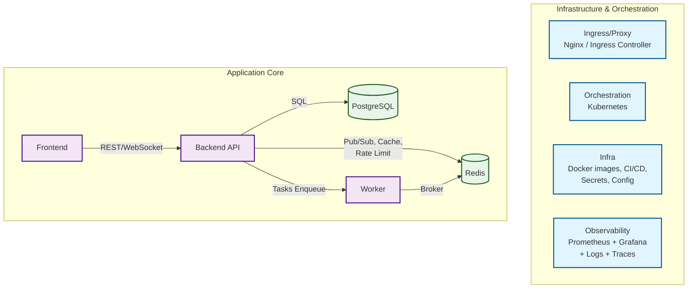

# Architecture Overview

Документ описывает архитектуру PET-проекта «SmartHabit» — сервиса трекинга привычек и микро-целей с real-time обновлениями, публичным API и дашбордами. Архитектура охватывает backend, frontend, хранение данных, кэш, брокер фоновых задач, прокси-слой, мониторинг, CI/CD и оркестрацию.

## 1. Architectural Goals

- Собрать end-to-end стек web-разработки.
    
- Обеспечить воспроизводимый деплой (Docker → Kubernetes).
    
- Обеспечить наблюдаемость (metrics, logs, traces).
    
- Поддержать real-time взаимодействие (WebSocket / PubSub).
    
- Отделить dev/staging/prod окружения.
    
- Минимизировать coupling между подсистемами.
    
- Позволить горизонтальное масштабирование backend и worker.
    

## 2. High-Level Components

Система состоит из следующих сервисов:

1. **Frontend (Web App)**
    
    - React + Vite + Tailwind
        
    - Авторизация, UI менеджмент привычек, прогресс, графики
        
    - Websocket-клиент
        
    - Общается с backend через REST + WS
        
2. **Backend API**
    
    - FastAPI
        
    - REST + Websocket
        
    - Бизнес-логика привычек, целей, прогресса
        
    - Auth (JWT)
        
    - SQLAlchemy + Alembic
        
    - Интеграция с Redis (кэш + pub/sub)
        
    - Prometheus metrics
        
3. **Worker / Scheduler**
    
    - Celery/RQ
        
    - Redis как broker
        
    - Выполняет отложенные задачи (reminders, housekeeping)
        
    - Может запускаться в нескольких экземплярах для scaling
        
4. **PostgreSQL**
    
    - Основное хранилище данных
        
    - ACID транзакции
        
    - Предполагается StatefulSet в k8s
        
    - Экспортер метрик для Prometheus
        
5. **Redis**
    
    - Кэш (горячие данные)
        
    - pub/sub для WS
        
    - broker очередей фоновых задач
        
    - rate-limiting (будущее расширение)
        
6. **Nginx (Reverse Proxy)**
    
    - В локальной разработке: точка входа
        
    - В Kubernetes: ingress-controller (или nginx-ingress)
        
7. **CI/CD**
    
    - GitHub Actions/GitLab CI
        
    - Сборка Docker images + тесты + деплой в k8s
        
8. **Kubernetes**
    
    - Orchestration + scaling
        
    - Deployment/StatefulSet/Service/Ingress/Secrets/ConfigMap
        
    - Dev/Staging/Prod через overlays или Helm
        
9. **Monitoring & Observability**
    
    - Prometheus (metrics)
        
    - Grafana (dashboards)
        
    - Loki/ELK (logs) (опционально)
        
    - Jaeger/Tempo + OpenTelemetry (traces)
        
10. **Secrets & Config**
    

- Kubernetes Secrets / Vault / Sealed Secrets
    
- env vars для dev
    

## 3. High-Level Architecture Diagram (text)

```
[Frontend] --(REST/WS)--> [Backend API] --(SQL)--> [PostgreSQL]
                                   |
                                   +--(Pub/Sub, Cache, RateLimit)--> [Redis]
                                   |
                                   +--(Tasks Enqueue)--> [Worker]
                                                     |
                                                     +--(Broker)--> [Redis]

Ingress/Proxy: [Nginx / Ingress Controller]
Orchestration: [Kubernetes]
Infra: [Docker images, CI/CD, Secrets, Config]
Observability: [Prometheus + Grafana + Logs + Traces]
```


## 4. API Protocols

- HTTP/REST для CRUD операций
    
- Websocket для push / realtime
    
- Internal IPC через Redis pub/sub + очереди
    
- Exporters Prometheus — pull model
    

## 5. Data Model (Top-Level)

Основные сущности:

- User
    
- Habit
    
- HabitRecord
    
- Goal (опционально)
    
- GoalRecord
    
- Notification
    
- APIKey
    
- AuditLog
    

Реляционные связи:

- User 1−N Habit
    
- Habit 1−N HabitRecord
    
- User 1−N Goal
    
- Goal 1−N GoalRecord
    

## 6. Deployment Environments

- Local: docker-compose
    
- Staging: k8s (kind/minikube или cloud)
    
- Prod: k8s (cloud)
    
- Различия между окружениями — через overlays/Helm values.
    

## 7. Scaling Strategy

- Backend: horizontal (Deployment + HPA)
    
- Worker: horizontal по задачам очереди
    
- Redis/Postgres: StatefulSet (вертикально + HA по необходимости)
    
- Frontend: статический + CDN (опционально)
    

## 8. Fault Tolerance & Reliability

- Redis используется как «не-критичный» caching layer
    
- PostgreSQL — критичный stateful компонент
    
- Worker изолирован от request cycle
    
- Возможность graceful shutdown + restart
    
- CI/CD сборка образов immutable
    

## 9. Observability Strategy

- Prometheus: latency/error rate/throughput/custom business metrics
    
- Grafana: визуализация (приложение + бизнес метрики)
    
- Logs: структурированные (JSON)
    
- Tracing: OpenTelemetry
    

## 10. Security Model

- Auth: JWT + refresh tokens
    
- Secrets: k8s secrets / sealed secrets
    
- TLS: cert-manager + LetsEncrypt
    
- Rate limiting (redis)
    
- Dependency scanning (CI)
    

## 11. Technology Stack Summary

- Python: FastAPI, SQLAlchemy, Alembic, pytest
    
- Frontend: React, Vite, Tailwind, Websocket
    
- DB: PostgreSQL
    
- Cache/Broker: Redis
    
- Containers: Docker
    
- Orchestrator: Kubernetes
    
- Proxy: Nginx/Ingress
    
- Monitoring: Prometheus + Grafana
    
- CI/CD: GitHub Actions/GitLab CI
    
- Tracing: OTel + Jaeger
    

## 12. Future Extensions

- WebPush notifications
    
- Public API keys + quotas
    
- Event-driven analytics
    
- Recommendation engine
    
- Mobile client
    

## 13. Non-Out-of-Scope (за рамками MVP)

- HA PostgreSQL + Patroni
    
- Redis cluster
    
- CDN
    
- Multi-cloud failover
    

---

Если нужно — могу:

1. адаптировать этот `architecture.md` под ГОСТ/ISO стиль,
    
2. сделать PlantUML диаграммы,
    
3. добавить sequence diagrams,
    
4. добавить ADR (architectural decisions record),
    
5. разделить документ на spec + design + impl.